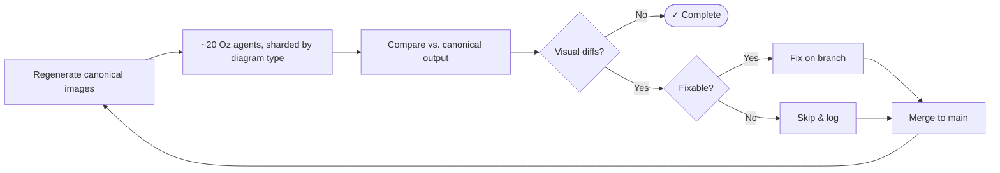

# Agent visual verification workflow

This document captures the agent prompts our team used to drive `mermaid_to_svg` toward visual parity with Mermaid reference output.

## High-level loop



## Diagram-type agent prompt

Use this prompt when assigning one agent to improve one diagram type.

```text
You are working on mermaid_to_svg.
Your assignment is to improve ONE diagram type toward Mermaid 11.12.2 visual parity.
Your diagram type: <DIAGRAM_TYPE>

Repository setup:
1. Start from the repository root.
2. Create a feature branch for your diagram type:
   git checkout -b <BRANCH_NAME>
3. Verify dependencies:
   node --version
   npx --version
   rustc --version
   cargo --version

If you need upstream Mermaid source for straight-port work, run:
./scripts/vendor_mermaid_js.sh

The vendored source will be at:
third_party/mermaid-js/11.12.2/

Read and follow the PNG visual comparison protocol below.

Workflow loop:
1. Run the visual test for your diagram type:
   ./scripts/visual_test.sh <DIAGRAM_TYPE>

   This generates PNG pairs in output/:
   - ref_<type>_<name>.png: Mermaid CLI reference
   - our_<type>_<name>.png: mermaid_to_svg output
   - our_<type>_<name>.svg: mermaid_to_svg SVG

2. Choose one focus fixture.
   Do not process every fixture at once.
   Pick the simplest or most representative mismatch.

3. Create a validation run directory:
   mkdir -p validation_runs/$(date +%Y%m%d_%H%M%S)_$(git rev-parse --short HEAD)_<DIAGRAM_TYPE>

4. Copy compared artifacts into that directory:
   - pre_ref_<key>.png
   - pre_our_<key>.png
   - pre_our_<key>.svg

5. Generate a detailed computer-vision-style comparison report:
   - Reference image description
   - Our image description
   - Numbered visual differences: D1, D2, D3, ...

   Print the report to screen and append it to:
   validation_runs/.../comparison_log.md

6. Select exactly one concrete next fix.
   The fix must target specific D# items from the comparison report.

7. Implement the smallest targeted code change.
   Prefer matching Mermaid 11.12.2 behavior from the vendored source over inventing custom rendering.

8. Run tests:
   cargo test --lib

9. Re-run visual verification:
   ./scripts/visual_test.sh <DIAGRAM_TYPE>

10. Copy post-fix artifacts:
    - post_ref_<key>.png
    - post_our_<key>.png
    - post_our_<key>.svg

11. Generate and log a post-fix CV report for the same fixture.

12. Repeat until:
    - the focus fixture is visually close to reference, or
    - the remaining mismatch is documented and not currently fixable.

Scope constraints:
- Prefer changes in the renderer/parser for your assigned diagram type.
- Avoid shared renderer/layout changes unless required and verified across representative fixtures.
- Do not optimize one fixture by breaking another.
- Check at least one simpler fixture of the same diagram type after each fix.
- Do not create a pull request unless explicitly asked.

Final report:
- Diagram type
- Fixture(s) checked
- Differences found
- Fixes made
- Tests run
- Remaining known mismatches
- Branch name
```

## PNG visual comparison protocol

### Goal

Achieve Mermaid 11.12.2 parity through concrete, fixture-backed PNG diffs.
Every comparison must produce a detailed, descriptive report that is printed to screen and logged to disk.

### Reference versions

The scripts pin:
- `@mermaid-js/mermaid-cli`: `11.4.2`
- `mermaid`: `11.12.2`

### Generate PNG pairs

Run:

```bash
./scripts/visual_test.sh <type>
```

Outputs:
- `output/ref_<type>_<name>.png`
- `output/our_<type>_<name>.png`
- `output/our_<type>_<name>.svg`

### Generate HTML comparisons

Run:

```bash
./scripts/visual_compare.sh <type>
```

Output:
- `output/comparison.html`

### Choose focus fixtures

Per iteration:
- Prefer exactly one focus fixture.
- Use at most two or three only when a fix must be validated across a small related set.

### Validation run directory

`validation_runs/` is gitignored.
For each iteration, create:

```bash
validation_runs/YYYYMMDD_HHMMSS_<gitsha>_<type>/
```

Include:
- `comparison_log.md`
- `pre_ref_<key>.png`
- `pre_our_<key>.png`
- `pre_our_<key>.svg`
- `post_ref_<key>.png`
- `post_our_<key>.png`
- `post_our_<key>.svg`

### CV report rules

Every report must include:
1. Reference image description
2. Our image description
3. Differences, numbered `D1`, `D2`, `D3`, ...
Rules:
- Keep the report descriptive.
- Do not speculate about root cause inside the CV report section.
- Make every D# specific and testable.
- Print the report and append it to `comparison_log.md`.
- If D# differences exist, continue into fix and verification in the same iteration.

### Report template for flowchart-like diagrams

Use this for diagrams with nodes and connecting edges.

#### 1. Reference image description

- Canvas: background, size, margins, padding.
- Counts:
  - Nodes
  - Edges
  - Edge labels
  - Clusters or subgraphs
- Nodes:
  - Text
  - Approximate position
  - Shape
  - Approximate width and height
  - Fill, stroke, stroke width, radius
  - Text alignment, wrapping, padding
- Edges:
  - From and to
  - Solid, dashed, dotted, thick
  - Arrowhead type, size, fill, stroke
  - Straight or curved
  - Bend count
  - Attachment points
  - Label text, background, placement
  - Overlaps

#### 2. Our image description

Repeat the same structure.

#### 3. Differences

For each `D#`:
- Element(s)
- Reference behavior
- Our behavior
- Magnitude and direction
- Collision or overlap impact

### Report template for non-flowchart diagrams

Use the same level of detail:
- Identify primary primitives:
  - columns/cards for kanban
  - axes/bars for gantt
  - slices/labels/legend for pie
  - periods/events for timeline
  - participants/messages/fragments for sequence
- Include counts and complete inventories.
- Describe text, sizes, shapes, colors, alignment, spacing, and relationships.

### Fix protocol

When proposing and implementing the next fix:
1. Reference the D# items it targets.
2. Search Mermaid 11.12.2 source for relevant terms:
   ```bash
   ./scripts/vendor_mermaid_js.sh
   ```
3. Prefer straight-porting Mermaid behavior from:
   `third_party/mermaid-js/11.12.2/`
4. State how the change should resolve the D# items.
5. Run:
   ```bash
   cargo test --lib
   ./scripts/visual_test.sh <type>
   ```
6. Produce a post-fix CV report for the same fixture.

### Restarting work

When resuming, include:
- Assigned diagram type
- Latest `validation_runs/.../comparison_log.md`
- Current focus fixture
- Latest known D# differences
- Proposed next fix

### Edge cases

Some reference output may contain nondeterministic text or IDs, such as gitGraph commit hashes.
For those cases, document parity criteria before chasing pixel diffs.
