# Visual Comparison: mermaid_to_svg vs mermaid-cli

Side-by-side comparison of our pure Rust rendering (left) against the canonical mermaid-cli output (right).

## Table of Contents

- [block](#block)
- [c4](#c4)
- [class](#class)
- [er](#er)
- [flowchart](#flowchart)
- [gantt](#gantt)
- [gitgraph](#gitgraph)
- [info](#info)
- [journey](#journey)
- [kanban](#kanban)
- [mindmap](#mindmap)
- [packet](#packet)
- [pie](#pie)
- [quadrant](#quadrant)
- [radar](#radar)
- [requirement](#requirement)
- [sankey](#sankey)
- [sequence](#sequence)
- [state](#state)
- [timeline](#timeline)
- [xychart](#xychart)

## block

### Block 01 Basic Block

| Ours (mermaid_to_svg) | Reference (mermaid-cli) |
|---|---|
|  |  |

### Block 02 Three Node Chain

| Ours (mermaid_to_svg) | Reference (mermaid-cli) |
|---|---|
|  |  |

### Block 03 Columns Layout

| Ours (mermaid_to_svg) | Reference (mermaid-cli) |
|---|---|
| 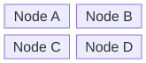 |  |

### Block 04 Standalone Nodes

| Ours (mermaid_to_svg) | Reference (mermaid-cli) |
|---|---|
|  |  |

## c4

### C4 01 Basic C4 Context

| Ours (mermaid_to_svg) | Reference (mermaid-cli) |
|---|---|
| 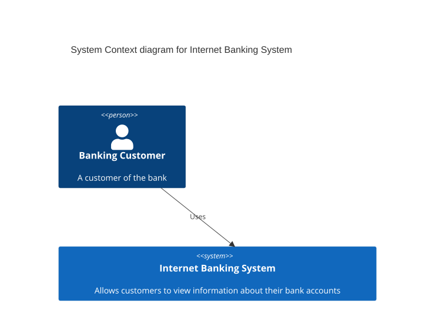 | 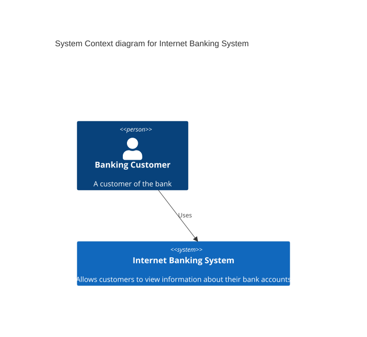 |

## class

### Class 01 Basic Classes

| Ours (mermaid_to_svg) | Reference (mermaid-cli) |
|---|---|
| 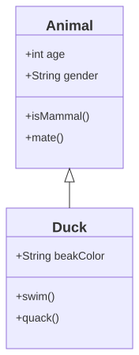 |  |

### Class 02 Relationships

| Ours (mermaid_to_svg) | Reference (mermaid-cli) |
|---|---|
|  |  |

## er

### Er 01 Basic Er

| Ours (mermaid_to_svg) | Reference (mermaid-cli) |
|---|---|
| 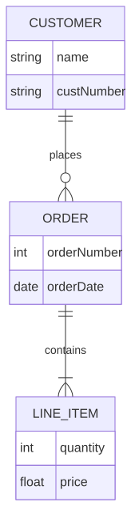 |  |

## flowchart

### Flowchart 01 Basic Flowchart

| Ours (mermaid_to_svg) | Reference (mermaid-cli) |
|---|---|
| 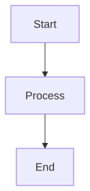 |  |

### Flowchart 02 Node Shapes

| Ours (mermaid_to_svg) | Reference (mermaid-cli) |
|---|---|
| 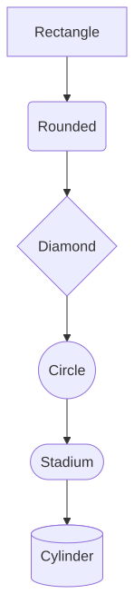 |  |

### Flowchart 03 Edge Types

| Ours (mermaid_to_svg) | Reference (mermaid-cli) |
|---|---|
|  |  |

### Flowchart 04 Edge Labels

| Ours (mermaid_to_svg) | Reference (mermaid-cli) |
|---|---|
| 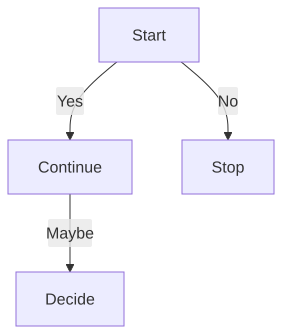 |  |

### Flowchart 05 Decision Flow

| Ours (mermaid_to_svg) | Reference (mermaid-cli) |
|---|---|
| 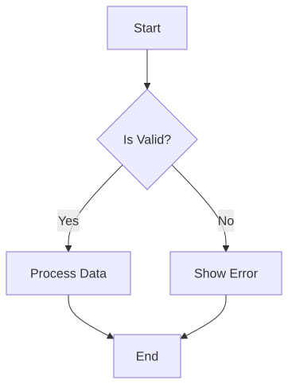 |  |

### Flowchart 06 Subgraphs

| Ours (mermaid_to_svg) | Reference (mermaid-cli) |
|---|---|
| 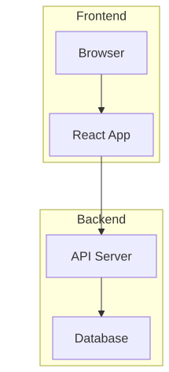 |  |

### Flowchart 07 Horizontal

| Ours (mermaid_to_svg) | Reference (mermaid-cli) |
|---|---|
|  |  |

### Flowchart 08 Complex Flow

| Ours (mermaid_to_svg) | Reference (mermaid-cli) |
|---|---|
| 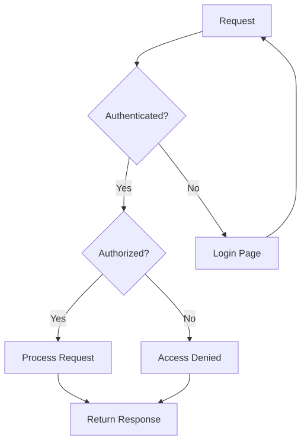 |  |

### Flowchart 09 Pipeline

| Ours (mermaid_to_svg) | Reference (mermaid-cli) |
|---|---|
| 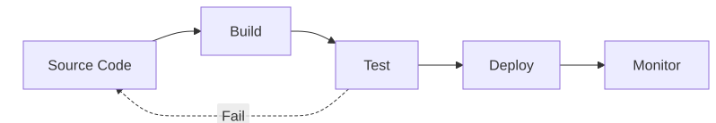 |  |

### Flowchart 10 State Machine

| Ours (mermaid_to_svg) | Reference (mermaid-cli) |
|---|---|
| 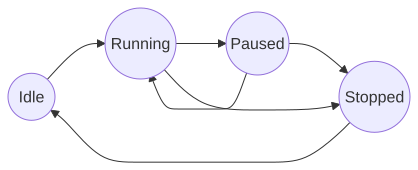 |  |

### Flowchart 11 All Shapes

| Ours (mermaid_to_svg) | Reference (mermaid-cli) |
|---|---|
| 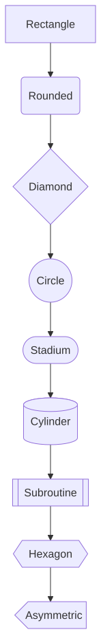 |  |

### Flowchart 12 Long Labels

| Ours (mermaid_to_svg) | Reference (mermaid-cli) |
|---|---|
| 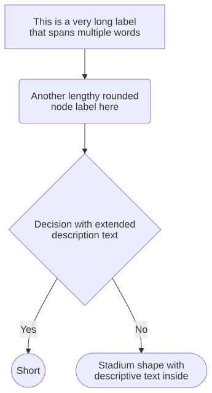 |  |

### Flowchart 13 Special Chars

| Ours (mermaid_to_svg) | Reference (mermaid-cli) |
|---|---|
| 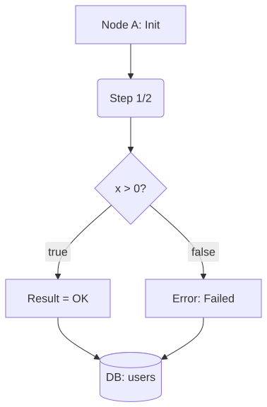 |  |

### Flowchart 14 Mixed Shapes Flow

| Ours (mermaid_to_svg) | Reference (mermaid-cli) |
|---|---|
| 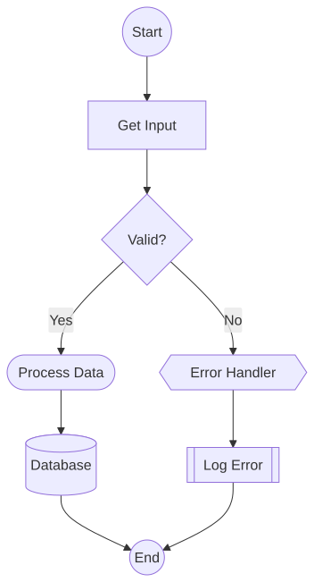 |  |

### Flowchart 15 Subroutine Focus

| Ours (mermaid_to_svg) | Reference (mermaid-cli) |
|---|---|
| 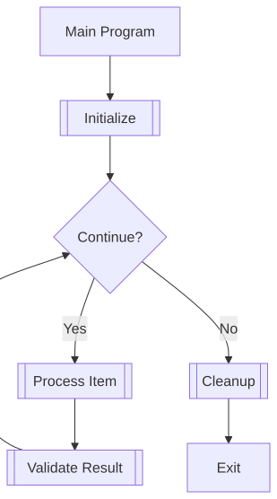 |  |

### Flowchart 16 All Edge Styles

| Ours (mermaid_to_svg) | Reference (mermaid-cli) |
|---|---|
|  |  |

### Flowchart 17 Mixed Edge Styles

| Ours (mermaid_to_svg) | Reference (mermaid-cli) |
|---|---|
| 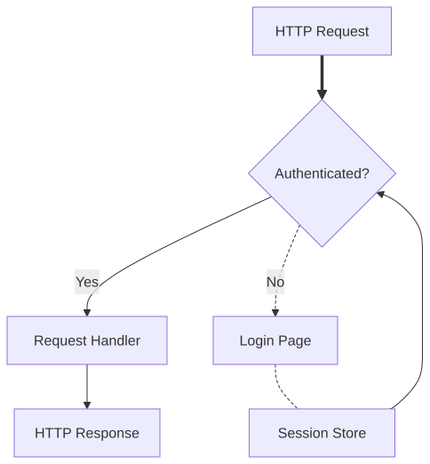 |  |

### Flowchart 18 Edge Direction Combo

| Ours (mermaid_to_svg) | Reference (mermaid-cli) |
|---|---|
| 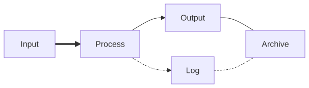 |  |

### Flowchart 19 Thick Emphasis

| Ours (mermaid_to_svg) | Reference (mermaid-cli) |
|---|---|
| 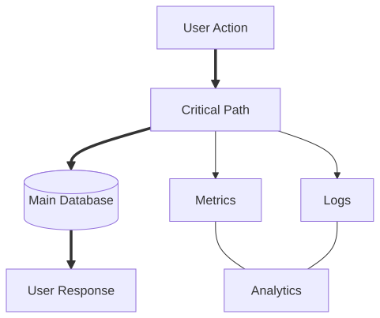 |  |

### Flowchart 20 Dotted Async

| Ours (mermaid_to_svg) | Reference (mermaid-cli) |
|---|---|
|  |  |

### Flowchart 21 Long Edge Labels

| Ours (mermaid_to_svg) | Reference (mermaid-cli) |
|---|---|
| 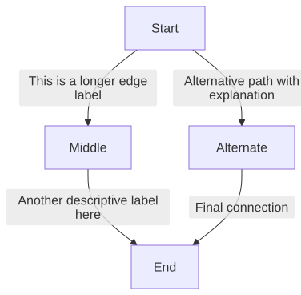 |  |

### Flowchart 22 Labels All Types

| Ours (mermaid_to_svg) | Reference (mermaid-cli) |
|---|---|
|  |  |

### Flowchart 23 Multi Branch Labels

| Ours (mermaid_to_svg) | Reference (mermaid-cli) |
|---|---|
| 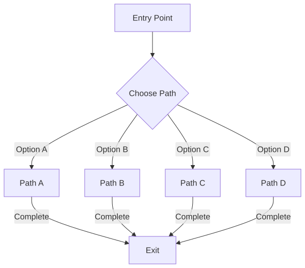 |  |

### Flowchart 24 Conditional Labels

| Ours (mermaid_to_svg) | Reference (mermaid-cli) |
|---|---|
| 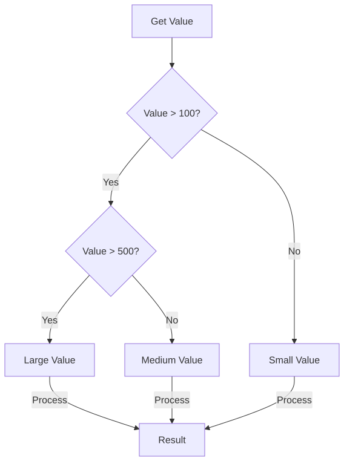 |  |

### Flowchart 25 Label Special Chars

| Ours (mermaid_to_svg) | Reference (mermaid-cli) |
|---|---|
| 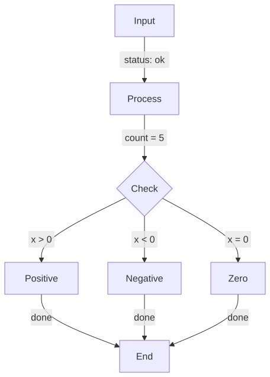 |  |

### Flowchart 26 Nested Subgraphs

| Ours (mermaid_to_svg) | Reference (mermaid-cli) |
|---|---|
| 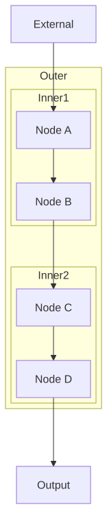 |  |

### Flowchart 27 Peer Subgraphs

| Ours (mermaid_to_svg) | Reference (mermaid-cli) |
|---|---|
|  |  |

### Flowchart 28 Subgraph Titles

| Ours (mermaid_to_svg) | Reference (mermaid-cli) |
|---|---|
|  |  |

### Flowchart 29 Cross Subgraph

| Ours (mermaid_to_svg) | Reference (mermaid-cli) |
|---|---|
|  |  |

### Flowchart 30 Large Subgraph

| Ours (mermaid_to_svg) | Reference (mermaid-cli) |
|---|---|
|  |  |

### Flowchart 31 Subgraph Directions

| Ours (mermaid_to_svg) | Reference (mermaid-cli) |
|---|---|
|  |  |

### Flowchart 32 Architecture

| Ours (mermaid_to_svg) | Reference (mermaid-cli) |
|---|---|
|  |  |

### Flowchart 33 Bottom To Top

| Ours (mermaid_to_svg) | Reference (mermaid-cli) |
|---|---|
|  |  |

### Flowchart 34 Right To Left

| Ours (mermaid_to_svg) | Reference (mermaid-cli) |
|---|---|
|  |  |

### Flowchart 35 Mixed Directions

| Ours (mermaid_to_svg) | Reference (mermaid-cli) |
|---|---|
|  |  |

### Flowchart 36 Complex Branching

| Ours (mermaid_to_svg) | Reference (mermaid-cli) |
|---|---|
|  |  |

### Flowchart 37 Git Workflow

| Ours (mermaid_to_svg) | Reference (mermaid-cli) |
|---|---|
|  |  |

### Flowchart 38 Microservices

| Ours (mermaid_to_svg) | Reference (mermaid-cli) |
|---|---|
|  |  |

### Flowchart 39 Event Driven

| Ours (mermaid_to_svg) | Reference (mermaid-cli) |
|---|---|
|  |  |

### Flowchart 40 Auth Flow

| Ours (mermaid_to_svg) | Reference (mermaid-cli) |
|---|---|
|  |  |

### Flowchart 41 Ecommerce Checkout

| Ours (mermaid_to_svg) | Reference (mermaid-cli) |
|---|---|
|  |  |

### Flowchart 42 Db Schema

| Ours (mermaid_to_svg) | Reference (mermaid-cli) |
|---|---|
|  |  |

### Flowchart 43 Api Lifecycle

| Ours (mermaid_to_svg) | Reference (mermaid-cli) |
|---|---|
|  |  |

### Flowchart 44 Error Handling

| Ours (mermaid_to_svg) | Reference (mermaid-cli) |
|---|---|
|  |  |

### Flowchart 45 Feature Flags

| Ours (mermaid_to_svg) | Reference (mermaid-cli) |
|---|---|
|  |  |

### Flowchart 46 Many Nodes

| Ours (mermaid_to_svg) | Reference (mermaid-cli) |
|---|---|
|  |  |

### Flowchart 47 Deep Branching

| Ours (mermaid_to_svg) | Reference (mermaid-cli) |
|---|---|
|  |  |

### Flowchart 48 Long Chain

| Ours (mermaid_to_svg) | Reference (mermaid-cli) |
|---|---|
|  |  |

### Flowchart 49 Dense Connections

| Ours (mermaid_to_svg) | Reference (mermaid-cli) |
|---|---|
|  |  |

### Flowchart 50 Style Statements

| Ours (mermaid_to_svg) | Reference (mermaid-cli) |
|---|---|
|  |  |

## gantt

### Gantt 01 Basic Gantt

| Ours (mermaid_to_svg) | Reference (mermaid-cli) |
|---|---|
|  |  |

## gitgraph

### Gitgraph 01 Basic Gitgraph

| Ours (mermaid_to_svg) | Reference (mermaid-cli) |
|---|---|
|  |  |

## info

### Info 01 Basic Info

| Ours (mermaid_to_svg) | Reference (mermaid-cli) |
|---|---|
|  |  |

## journey

### Journey 01 Basic Journey

| Ours (mermaid_to_svg) | Reference (mermaid-cli) |
|---|---|
|  |  |

### Journey 02 Multi Actor Journey

| Ours (mermaid_to_svg) | Reference (mermaid-cli) |
|---|---|
|  |  |

## kanban

### Kanban 01 Basic Kanban

| Ours (mermaid_to_svg) | Reference (mermaid-cli) |
|---|---|
|  |  |

### Kanban 02 Assigned Kanban

| Ours (mermaid_to_svg) | Reference (mermaid-cli) |
|---|---|
|  |  |

### Kanban 03 Priority Kanban

| Ours (mermaid_to_svg) | Reference (mermaid-cli) |
|---|---|
|  |  |

### Kanban 04 Multi Column Kanban

| Ours (mermaid_to_svg) | Reference (mermaid-cli) |
|---|---|
|  |  |

## mindmap

### Mindmap 01 Basic Mindmap

| Ours (mermaid_to_svg) | Reference (mermaid-cli) |
|---|---|
|  |  |

## packet

### Packet 01 Basic Packet

| Ours (mermaid_to_svg) | Reference (mermaid-cli) |
|---|---|
|  |  |

## pie

### Pie 01 Basic Pie

| Ours (mermaid_to_svg) | Reference (mermaid-cli) |
|---|---|
|  |  |

## quadrant

### Quadrant 01 Basic Quadrant

| Ours (mermaid_to_svg) | Reference (mermaid-cli) |
|---|---|
|  |  |

## radar

### Radar 01 Basic Radar

| Ours (mermaid_to_svg) | Reference (mermaid-cli) |
|---|---|
|  |  |

## requirement

### Requirement 01 Basic Requirement

| Ours (mermaid_to_svg) | Reference (mermaid-cli) |
|---|---|
|  |  |

## sankey

### Sankey 01 Basic Sankey

| Ours (mermaid_to_svg) | Reference (mermaid-cli) |
|---|---|
|  |  |

## sequence

### Sequence 01 Basic Sequence

| Ours (mermaid_to_svg) | Reference (mermaid-cli) |
|---|---|
|  |  |

### Sequence 02 Loops And Notes

| Ours (mermaid_to_svg) | Reference (mermaid-cli) |
|---|---|
|  |  |

## state

### State 01 Basic State

| Ours (mermaid_to_svg) | Reference (mermaid-cli) |
|---|---|
|  |  |

### State 02 Choice And Fork

| Ours (mermaid_to_svg) | Reference (mermaid-cli) |
|---|---|
|  |  |

## timeline

### Timeline 01 Basic Timeline

| Ours (mermaid_to_svg) | Reference (mermaid-cli) |
|---|---|
|  |  |

## xychart

### Xychart 01 Basic Xychart

| Ours (mermaid_to_svg) | Reference (mermaid-cli) |
|---|---|
|  |  |
